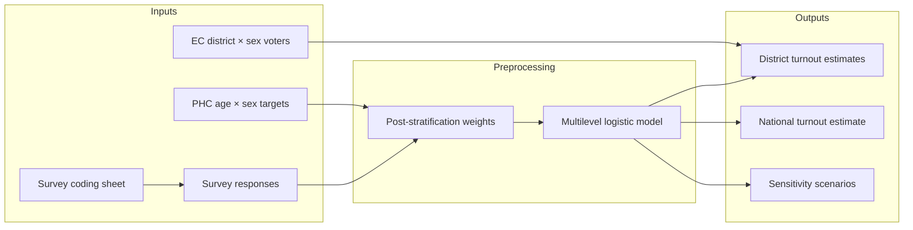

# Bangladesh Electoral Turnout — Multilevel Regression with Post-stratification (MRP)

This repository contains the data inputs and R analysis pipeline for estimating district-level voter turnout in Bangladesh using survey data, population benchmarks, and Election Commission (EC) registered-voter counts. The core method is **multilevel regression with post-stratification (MRP)**: a Bayesian logistic model fit on weighted survey responses, then applied to a post-stratification frame built from official population and registration data.

## Repository contents

| Path | Description |
|------|-------------|
| `EC_registered_voters_english.xlsx` | District-level registered voter counts by sex (sheet: `EC_Count_English`) |
| `PHC_national_age_sex_18plus.xlsx` | National adult population shares by age group and sex (sheet: `national_age_sex_18plus`) |
| `response_data_1.xlsx` | Raw survey responses (sheet 1) |
| `survey_coding_sheet_english.xlsx` | Codebook: variable mapping, category codes, multi-select options, district name standardization |
| `electoral-studies-mrp/` | R project and full analysis script (`electoral-studies-mrp.R`) |

Generated artifacts (tables, plots, fitted models, sensitivity runs) are written to `outputs/` at runtime. That folder is **not** version-controlled.

Local reference documents at the project root (`*.pdf`, `*.docx`) are also excluded from git.

## Method overview



### Pipeline stages

The script `electoral-studies-mrp/electoral-studies-mrp.R` runs sequentially through these stages:

1. **Setup** — Load packages (`readxl`, `dplyr`, `survey`, `brms`, `tidybayes`, etc.) and define paths.
2. **Coding sheet** — Import variable mappings, category codes, multi-select definitions, and district standardization lists.
3. **Survey cleaning** — Rename core variables (age, sex, education, district, turnout intention) using robust pattern matching on Bengali/English headers.
4. **District harmonization** — Map raw district names to standardized labels; flag unmatched districts.
5. **Outcome construction** — Define binary turnout outcomes:
   - `y_strict`: “will definitely vote”
   - `y_likely`: “definitely” or “probably will vote”
6. **PHC alignment** — Load national age × sex population targets for adults 18+.
7. **Calibration weights** — Direct post-stratification weights so weighted survey totals match PHC cell targets (age × sex). Includes a hard `stopifnot` guard that weighted cell totals equal targets.
8. **Descriptives** — Weight histograms and turnout tables/plots by age and sex.
9. **EC post-strat frame** — Load district × sex registered-voter counts for post-stratification.
10. **Bayesian MRP model** — `brms` logistic regression with random intercepts by district:
    - Predictors: age group, sex, education
    - Survey weights: normalized calibration weights (`w_cal_norm`)
    - Quick sanity fit, then full 4-chain model
11. **Post-stratification** — Predict turnout probabilities for district × sex × age cells, collapse over age using PHC shares, aggregate to district and national estimates with 95% credible intervals.
12. **Results pack** — Export `10_turnout_estimates.xlsx` and diagnostic plots.
13. **Sensitivity analysis** — Five scenarios varying outcome definition, weights, and model specification:
    - `BASE_strict_cal` — strict outcome, calibrated weights, full model
    - `S1_likely_cal` — broader “likely” outcome
    - `S2_strict_unweighted` — no survey weights
    - `S3_strict_trim99` — weights trimmed at 99th percentile
    - `S4_strict_noedu` — education predictor dropped

## Requirements

- **R** ≥ 4.0 (recommended)
- **RStudio** (optional; open `electoral-studies-mrp/electoral-studies-mrp.Rproj`)

### R packages

The script installs missing packages automatically on first run:

```
readxl, writexl, dplyr, stringr, tidyr, forcats, janitor,
ggplot2, scales, survey, brms, tidybayes, posterior
```

`brms` requires a C++ toolchain (Rtools on Windows). Full model fitting is computationally intensive; allow several hours on a typical laptop.

## Getting started

1. Clone or copy this repository so the four input `.xlsx` files sit in the **project root** alongside `electoral-studies-mrp/`.

2. Open `electoral-studies-mrp/electoral-studies-mrp.Rproj` in RStudio, or set your working directory to the project root.

3. **Update the base path** in `electoral-studies-mrp.R` if your folder is not `F:/Research_EC`:

   ```r
   base_dir <- "F:/Research_EC"   # change to your local path
   out_dir  <- file.path(base_dir, "outputs")
   ```

4. Source or run the script line by line (recommended for first use) or execute the full pipeline:

   ```r
   source("electoral-studies-mrp/electoral-studies-mrp.R")
   ```

5. Outputs appear in `outputs/` (created automatically). Key files include:

   | File | Content |
   |------|---------|
   | `03_survey_ready_corevars.xlsx` | Cleaned survey with standardized factors |
   | `06_weights_and_weighted_survey.xlsx` | Calibration weights and weighted data |
   | `07_descriptive_turnout_tables.xlsx` | Weighted turnout descriptives |
   | `09_model_core_summary.txt` | Full `brms` model summary |
   | `10_turnout_estimates.xlsx` | District and national MRP estimates |
   | `RESULTS_pack.xlsx` | Consolidated results for reporting |
   | `SENSITIVITY_01_tables.xlsx` | Sensitivity scenario comparisons |
   | `model_core.rds` | Saved `brms` fit object |
   | `plot_*.png` | Diagnostic and results figures |

## Input data reference

### `survey_coding_sheet_english.xlsx`

| Sheet | Purpose |
|-------|---------|
| `Variable_Mapping` | Maps original Bengali survey headers to short variable names |
| `Category_Codes` | Response code labels |
| `MultiSelect_Options` | Multi-select question dummy definitions |
| `District_Raw_List` | Raw district strings → standardized `district_std` |

### `EC_registered_voters_english.xlsx`

Sheet `EC_Count_English` — columns include `district_std`, `total_voters`, `male_voters`, `female_voters`.

### `PHC_national_age_sex_18plus.xlsx`

Sheet `national_age_sex_18plus` — national adult population shares by `age_group` and `sex`.

### `response_data_1.xlsx`

Raw survey export; the script detects core columns by Bengali/English header patterns.

## Notes

- The pipeline sets a UTF-8 locale on Windows to handle Bengali text in survey fields and outputs.
- Excel file locking on Windows is handled via `safe_write_xlsx()`, which writes to a timestamped temp file if the target is open.
- Sensitivity runs use shorter MCMC settings (`iter = 1200`) for speed; increase to `2000` for publication-quality inference.
- District estimates use EC registered-voter counts as population weights; national estimates integrate over all districts.

## License

Data and code are provided for research purposes. Confirm appropriate use and citation requirements for the underlying survey and official statistics before publication.
